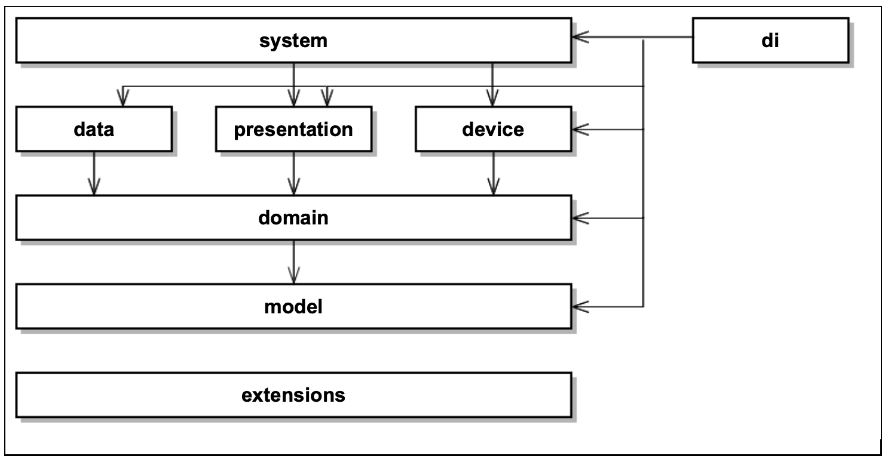

# Common clean architecture struture
version: 1.0.0

### Model layer
**Description:** Contains business entities (fe. User, Vehicle).

**Includes:** 
 - model (data) classes
 - enums
 - can also contain files with theirs extensions
  
**Platform dependency:** This layer is platform independent - doesn’t use any platform SDK. 

**Other layers dependencies:** Model layer can only depend on extensions layer.

### Domain layer
**Description:** Contains business interactors (use cases).
**Includes:**

 - use case implementations - [*]UseCase 
 - repository interfaces - [*]Repository 
 - controller interfaces - [*]Controller
 - can also contain files with theirs extensions

**Platform dependency:** This layer is platform independent - doesn’t use any platform SDK. 

**Other layers dependencies:** Domain layer depends on model layers. It also can use extensions from extensions layer.

💡 *Repositories are classes or components that encapsulate the logic required to access data sources. For more information read more about Repository pattern.*

💡 *Controllers contains logic which is not providing data from data sources. Typically it's the logic where we need to use system (Android) - permissions gaining, notifications and so on.*

### Data layer
**Description:** Contains repository implementations which are defined in domain layer. Represents data sources.

**Includes:** 
 - repository implementations - [*]Repository 
 - (db/io) entities - [*]Entity

**Platform dependency:** This layer can depend on specific platform. Developer can use platform SDK.

**Other layers dependencies:** Data layer depends on model and domain layer. It also can use extensions from extensions layer.

💡 *Repositories are classes or components that encapsulate the logic required to access data sources. For more information read more about Repository pattern.*

### Presentation layer
**Description:** Contains presentation classes in term of view models. It converts use case results to view objects for view consumers. 

**Includes:**
 - view model implementations - [*]ViewModel 
 - view objects - [*]Vo

**Platform dependency:** This layer should be platform independent. We have only one exception - developer can use specific platform features as AndrodiViewModel etc... 

**Other layers dependencies:** Presentation layer depends on model and domain layer. It also can use extensions from extensions layer.

### Device layer
**Description:** Contains controller implementations which are defined in domain layer. 

**Includes:**
 - controller implementations - [*]Controller

**Platform dependency:** This layer is platform independent.

**Other layers dependencies:** Device layer depends on model and domain layer. It also can use extensions from extensions layer.

💡 *Controllers contains logic which is not providing data from data sources. Typically it's the logic where we need to use system (Android, iOS) - permissions gaining, notifications and so on.*

### System layer
**Description:** Contains platform specific implementations (Activities, Fragments, Views, ....) 

**Includes:**
 - Application - [*]Application 
 - AppDelegate - ...
 - Activities - [*]Activity 
 - Fragments - [*]Fragment 
 - Views - [*]View
 - Layouts - [*]Layout
 - Services - [*]Service
 - Adapters - [*]Adapter
 - 
 - Delegates - [*]Delegate 
 - (Broadcast)Receivers - [*]Receiver
 - iOS Controllers ...

**Platform dependency:** This layer depends on platform SDK.

**Other layers dependencies:** System layer depends on presentation and device layer. It also can use extensions from extensions layer.

### DI layer
**Description:** Contains dependency injection definition.

**Includes:**
 - dependency injection files with di definition
**Platform dependency:** This layer depends on Android, iOS SDK. 

**Other layers dependencies:** DI layers can use all other layers.

### Extensions layer
**Description:** Contains programming language extensions. Fe. custom Flow implementation. Mostly you don’t need to use this layer.
