# Matee Wiki - iOS - Release - Automatic release (setup CI)

## Basic info + Prerequisities
- There are infinite options how to setup CI, this tutorial showcases just one example based on [Matee DevStack](https://github.com/MateeDevs/devstack-native-app)
- It consists from the [fastlane](https://docs.fastlane.tools) configuration and runs via [GitHub Actions](https://docs.github.com/en/actions) on [self-hosted runners](https://docs.github.com/en/actions/hosting-your-own-runners/managing-self-hosted-runners/about-self-hosted-runners) (most common setup for our projects)
- If the project requires something else you have to adjust the setup by yourself (just UTFG :upside_down_face:)

## 1) Create a Development certificate
- For its simplicity we are usually using Xcode Cloud Signing for CI builds - we partially sign the build with a Development certificate and Xcode Cloud Signing then completes the signing for Distribution, you can find more details in [this WWDC session](https://developer.apple.com/videos/play/wwdc2021/10204/)
- In CI environment you can get a clean instance for every build, therefore we have to create and store the Development certificate in the repository
- Open Keychain Access on your Mac and go to Certificate Assistant - Request a Certificate From a Certificate Authority

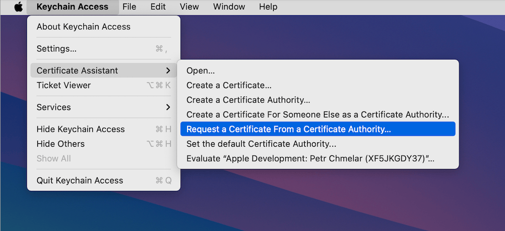

- Fill in the request and save the CertificateSigningRequest somewhere.
- It doesn't matter what information you fill in, but for consistency prefer `Matee Fastlane` / `mateefastlane@gmail.com`

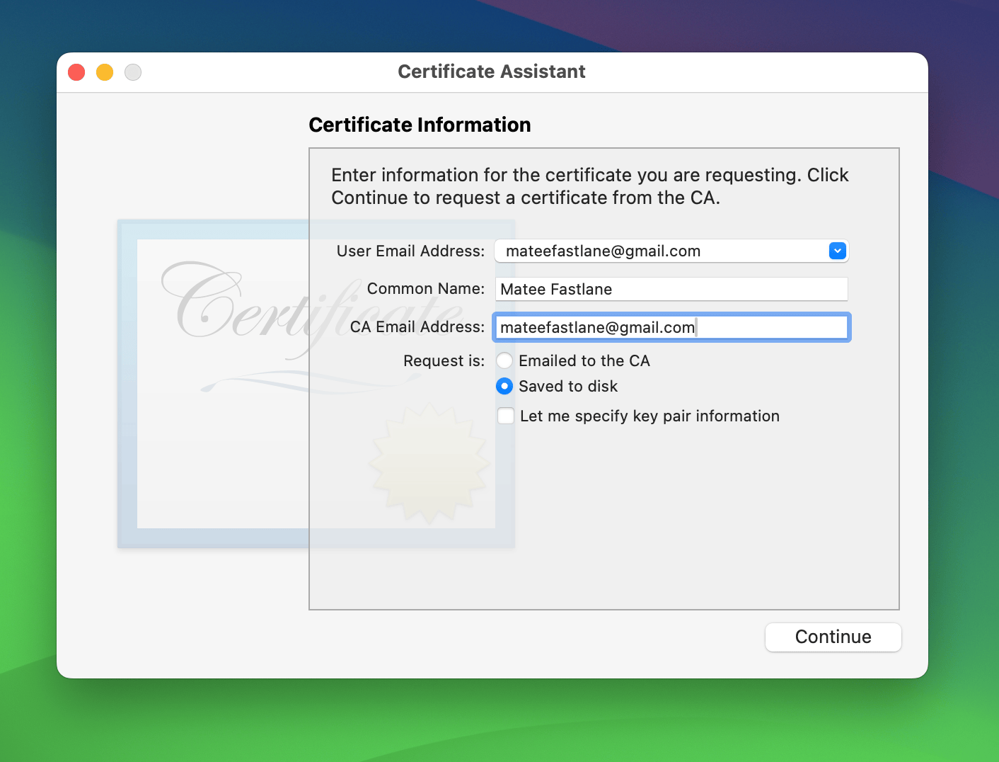

- Go to the [Apple Developer portal](https://developer.apple.com/account/resources/certificates/list) and create a new Apple Development certificate
- You will have to upload the previously created CertificateSigningRequest, after that download the newly created certificate

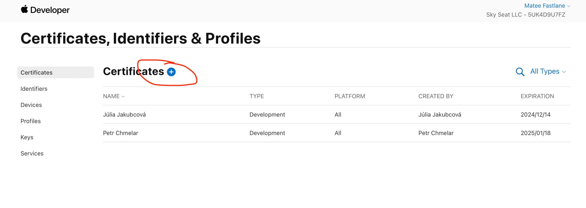

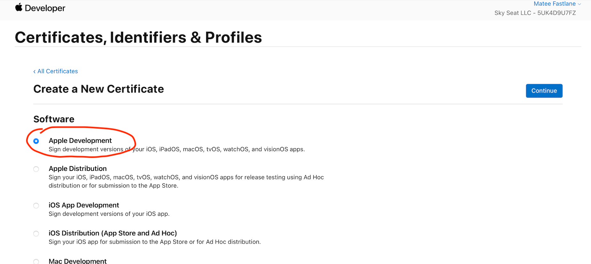

- Import the downloaded `.cer` to the Keychain Access by double click
- Find the certificate in the Keychain Access (sort by expiration) and export its `.p12` by right click and selecting Export

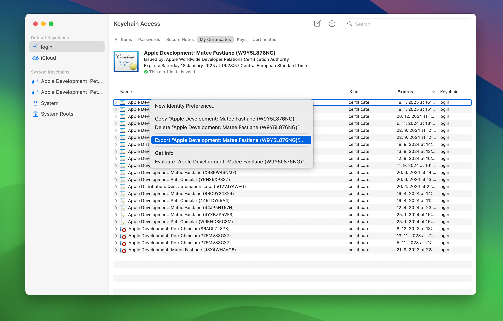

- Two password prompts will appear, the first is about protecting the certificate by adding additional password, you can just leave it blank
- Second prompt needs a login password of your Mac user account

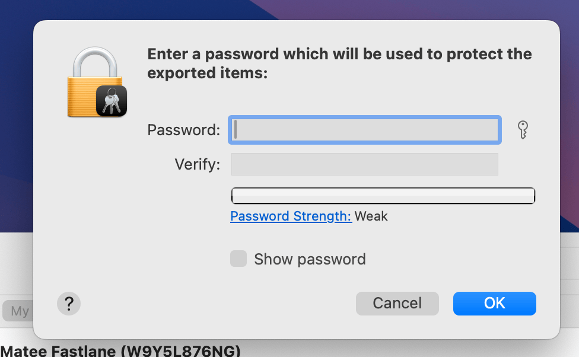

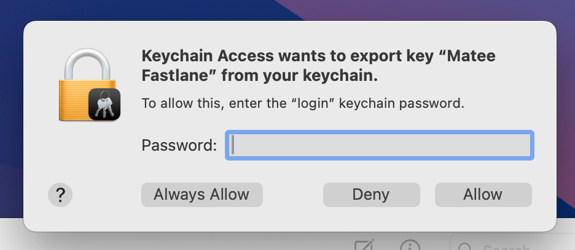

- Finally rename and move both `.cer` and `.p12` into `Signing` directory in the repository
- Naming convention is `Development_[CompanyName].cer` / `Development_[CompanyName].p12`

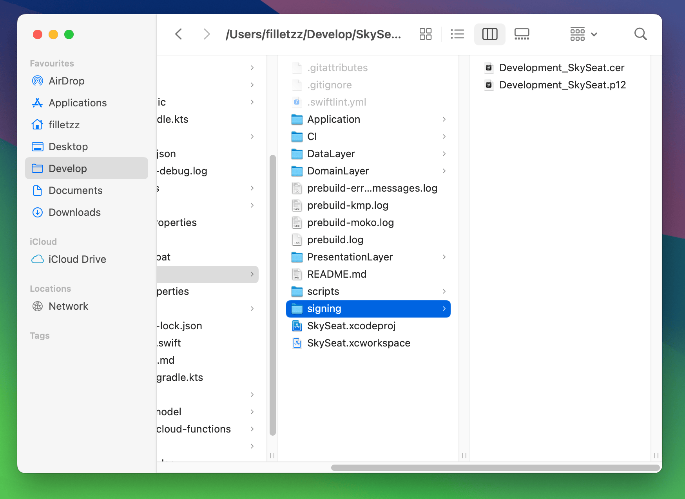

## 2) Generate App Store Connect API key

- An API key is needed in order to sign the build and then upload it to the App Store Connect
- Go to the [App Store Connect](https://appstoreconnect.apple.com/access/api) and generate a new API key with Admin role (App Manager should be enough, but it's not tested ATM)
- Only an user with Account Holder or Admin role can generate API keys, so you may need to contact someone with that role

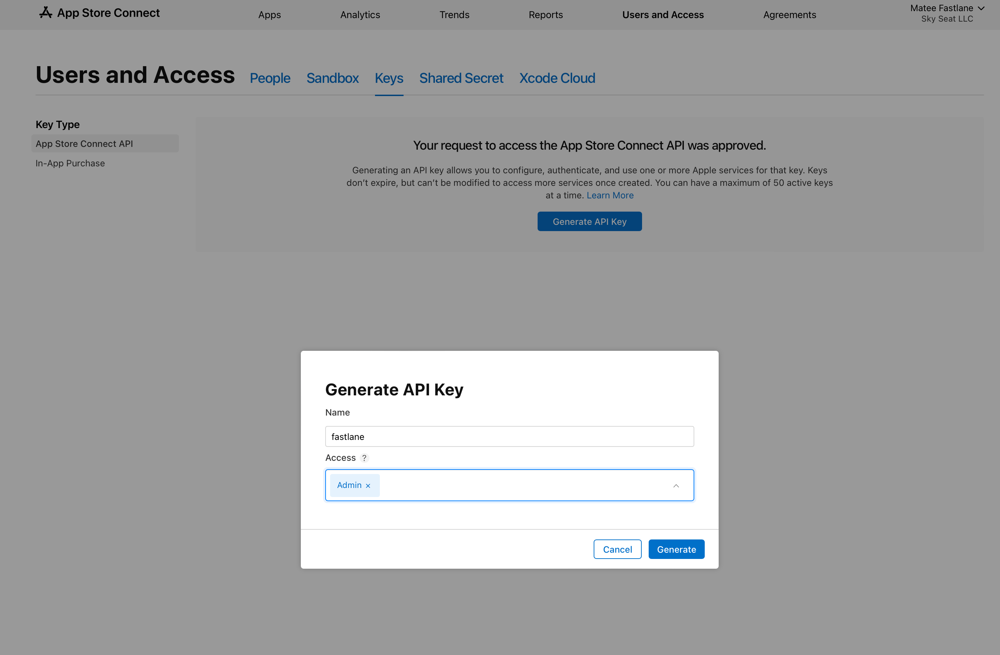

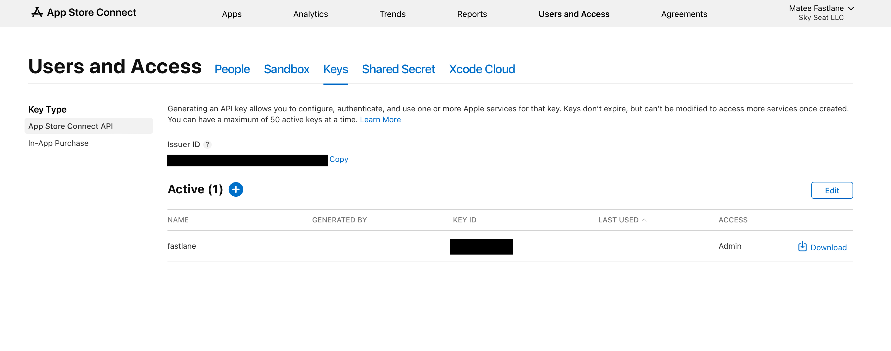

## 3) Configure GitHub Actions for the repository

- On GitHub, open the settings of project's repository, go to Secrets and variables - Actions and create a new repository secret
- Name the secret as `APP_STORE_CONNECT_API_KEY_[COMPANY_NAME]` in order to avoid naming conflicts and insert content of the API key created in the previous step
- An Admin access to the repository is needed to define secrets, so you may need to contact someone with that role

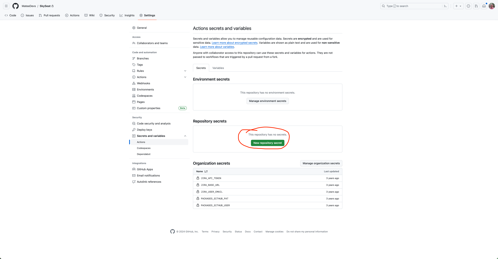

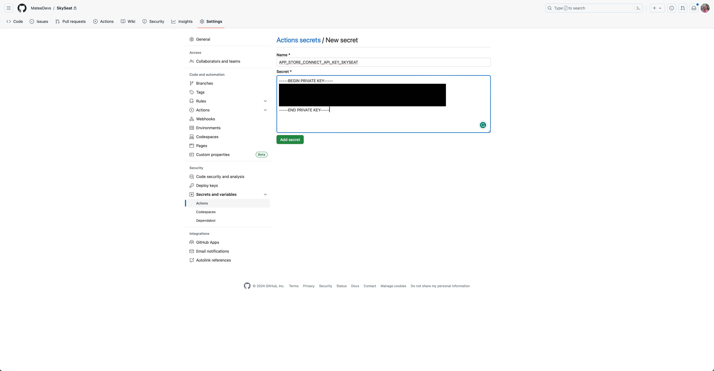

- There is a FASTLANE_SLACK_URL secret defined at organization level, which contains a webhook to deliver CI messages to the Matee's Slack
- If you want to deliver CI messages into another Slack, you can simply override the value by defining a FASTLANE_SLACK_URL secret at repository level

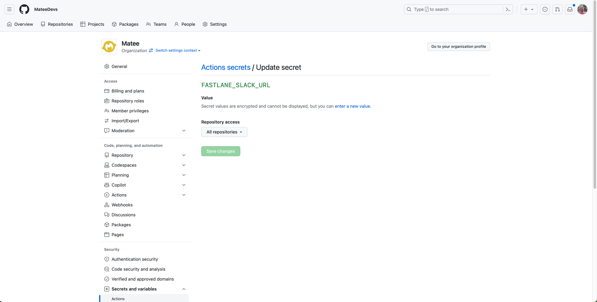

- Self-hosted runners must be allowed for the project's repository
- This must be done by the GitHub organization Admin, so you may need to contact someone with that role

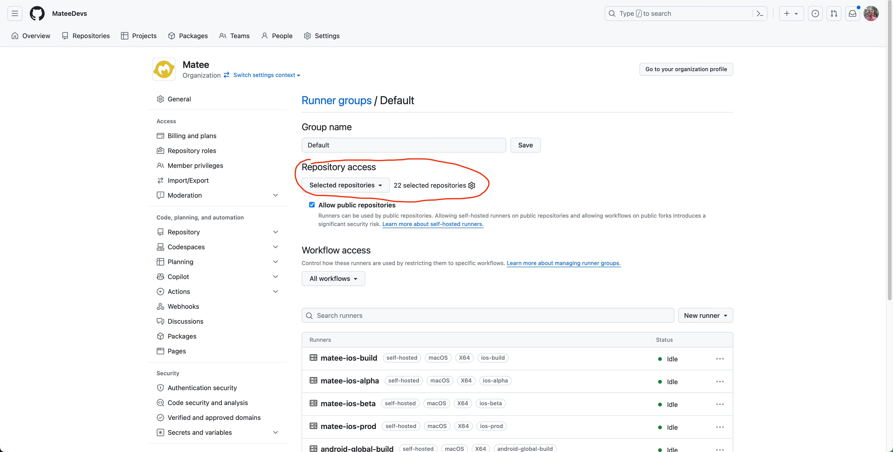

## 4) Adjust GitHub Actions and fastlane configurations

- There are three prepared workflows for GH Actions - test (runs tests on commit to PR) / develop (distribute alpha on closed PR) / release (distribute alpha/beta/prod on manual trigger)
- If you need other workflows or behavior you have to adjust as needed - you should find everything in the [GitHub Actions](https://docs.github.com/en/actions) and [fastlane](https://docs.fastlane.tools) documentations
- To use those three prepared ensure that `APP_STORE_CONNECT_API_KEY_CONTENT` points to the GH Actions secret created in step 2 and is saved into `AuthKey_[CompanyName].p8`
- In fastlane configuration you have to modify the `AppStoreConnectAPIKey` (`id` and `issuerId` are from step 2) and the `BuildConfiguration` (according to your project)

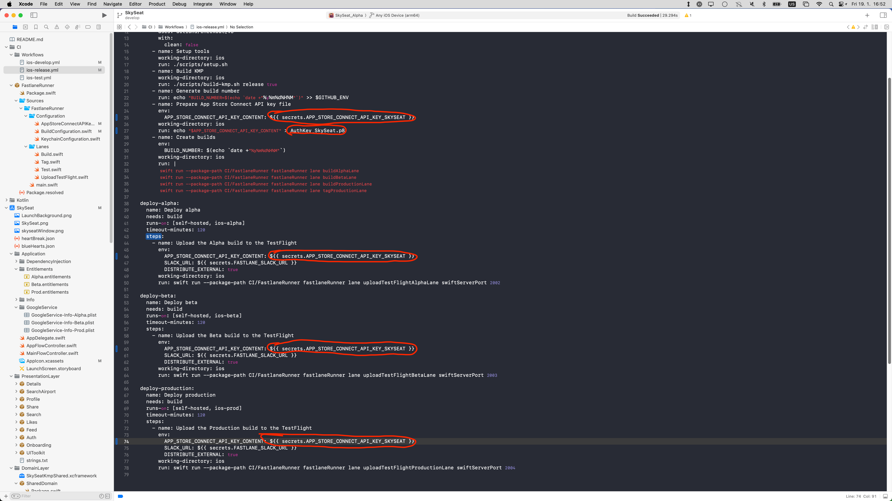

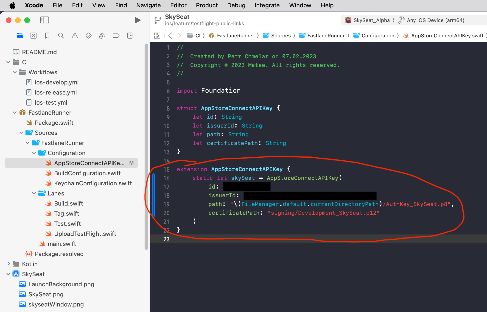

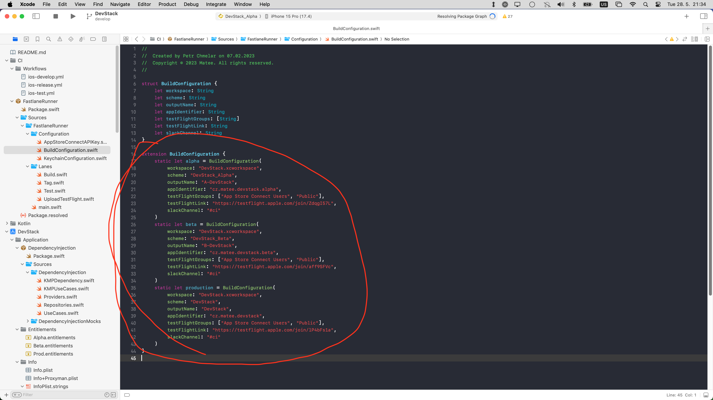

## 5) Rock'n'Roll :metal:

- Push your changes to git and verify whether everything works as expected
- Some workflows must be merged to the default branch before they can be triggered
