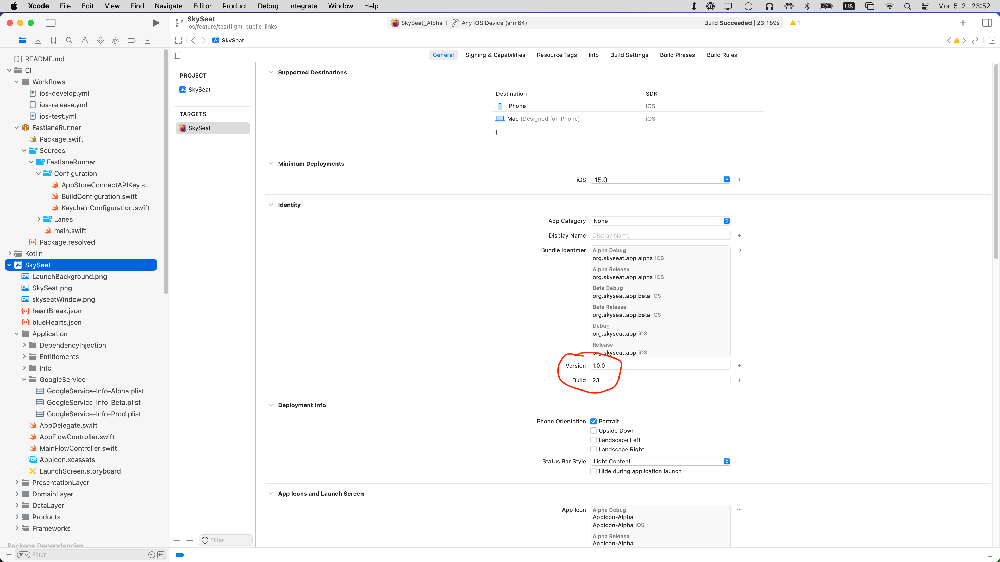
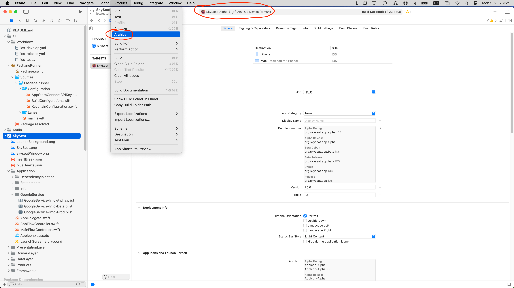
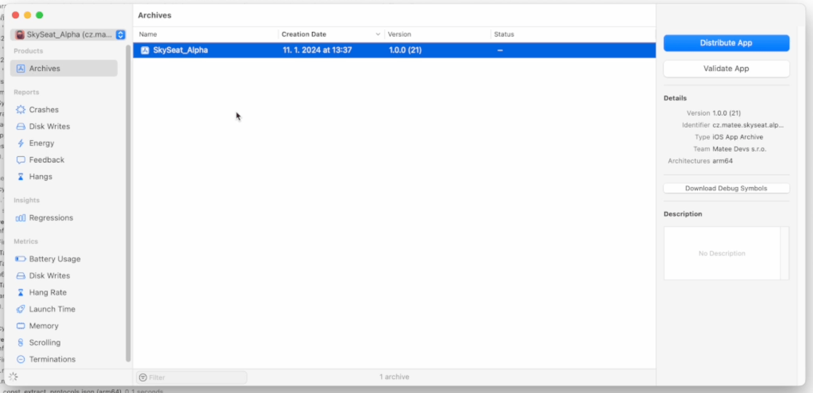
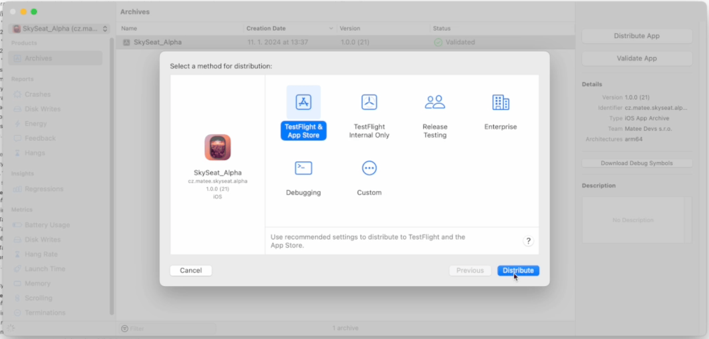
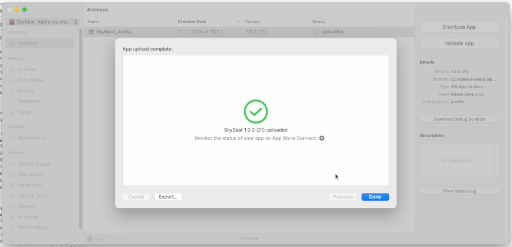

# Matee Wiki - iOS - Release - Manual release

## 1) Adjust version and build numbers
- When releasing apps manually there is usually no automatization for adjusting build numbers
- So in Xcode open Project - General and adjust them as needed
- Version number must be higher than currently released (or approved) version in the App Store Connect
- Build number for a given version must be higher than in build previously uploaded to the App Store Connect

## 2) Archive
- Select a proper scheme and device in the Xcode and go to Product - Archive
- As device you must select either a real device or `Any iOS Device` (simulators doesn't work)

## 3) Distribute 🚀
- Once your archive is ready, an Organizer window will appear
- If you somehow close this window it can be opened from Window - Organizer
- Here you can Validate your archive if you want, then select Distribute
- As a distribute method select `TestFlight & App Store`

