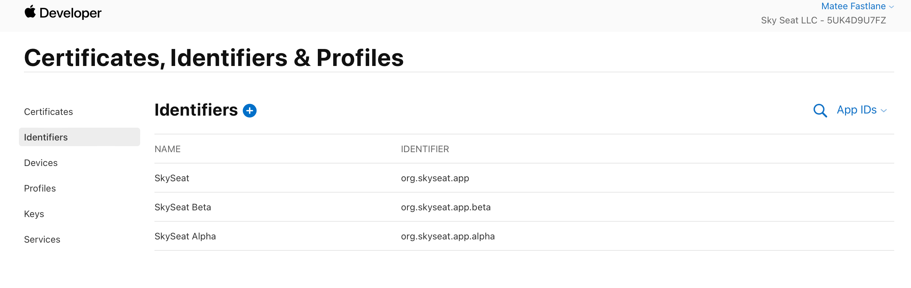
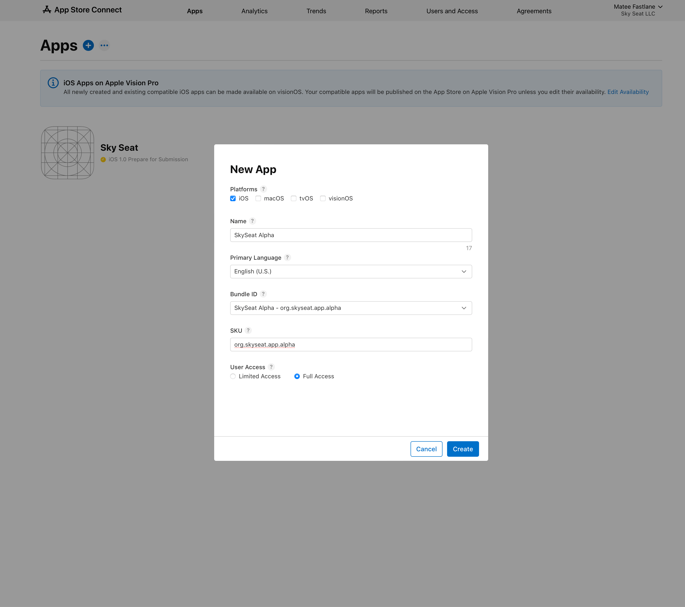
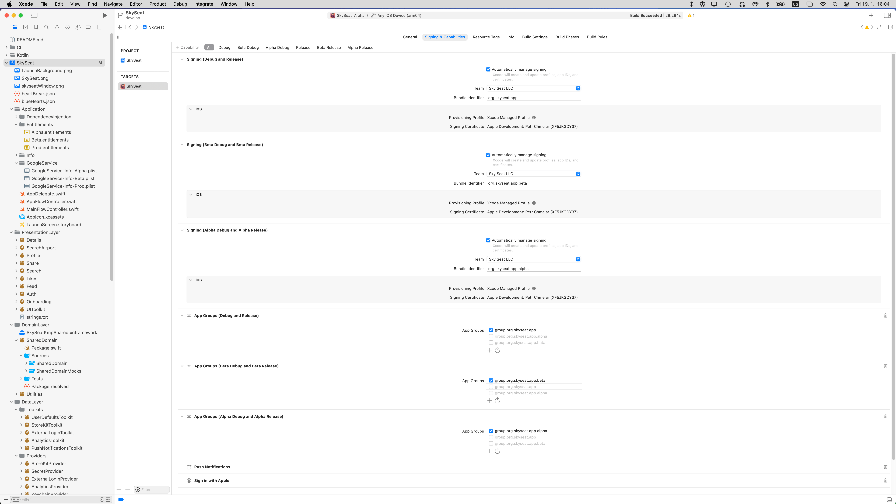
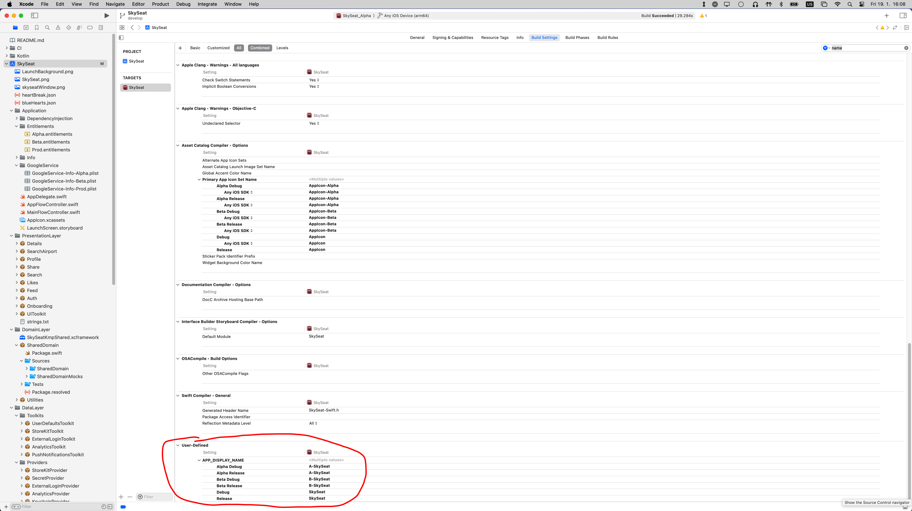
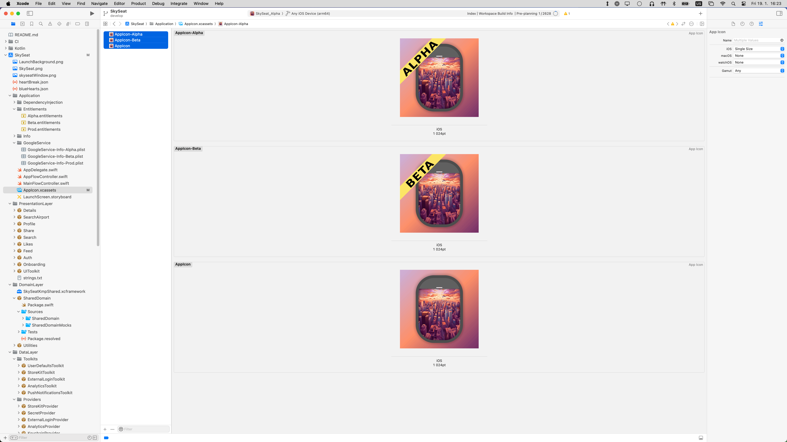

# Matee Wiki - iOS - Release - Prepare app for 1st release

## Basic info + Prerequisities
- During the development phase we may be using some temporary IDs etc (usually `cz.matee.xxx`) - all this must be changed before the 1st release
- If not stated otherwise, we are releasing all builds (including alpha/dev/etc) under the client's Apple Developer account
- You must be added to that Apple Developer account with at least Developer role and enabled access to certificates

## 1) Create App IDs
- All needed App IDs must be created on the [Apple Developer portal](https://developer.apple.com/account/resources)
- Please use a naming convention: `[tld].[company_name].[app_name](.[flavor])`
- When creating the AppID choose all needed capabilities (take a look into Xcode - Project - Signing & Capabilities)
- More complex capabilities (like Push Notifications, Sign in with Apple, etc) must be configured properly - this can be done later but don't forget to do it!
- You can bump into `An AppID with Identifier 'x' is not available.` error - it means that the AppID is already used by some other Apple Developer account (usually Matee in this case) - you have to delete it there first

## 2) Create apps on App Store Connect
- For every App ID create an app on [App Store Connect](https://appstoreconnect.apple.com/apps)
- Select App ID from the dropdown as Bundle ID and in SKU just re-write the App ID
- If you already know Name & Primary Language great! If not, don't worry, it can be changed later

## 3) Configure in Xcode
- In Xcode go to Project - Signing & Capabilities and change Team to the client's Apple Developer account
- Make sure that `Automatically manage signing` checkbox is selected
- Now change `Bundle Identifier` to the newly created App IDs
- If the project is using App Groups (very likely) you have to change them as well (use convention `group.[AppID]`)
- You can get `An Application Group with Identifier 'x' is not available.` errors. This is the same problem as above - you have to delete it from the other Apple Developer account first

## 4) Firebase
- If the app is using Firebase, ensure that the app is connected to the client's Firebase project
- In case you have to change a Firebase project, you have to change a `GoogleService-Info.plist` files
- These files are usually located in the `Application/GoogleService` directory

## 5) Check app's name and icon
- Verify that app's name and icon are configured properly
- App's name is usually defined as `APP_DISPLAY_NAME` in Project - Build Settings
- App's icon is usually located in the `Application/AppIcon.xcassets` directory
- When changing icons it is preferred to use compressed PNGs (see [pngquant](https://pngquant.org)) and use `Single Size` option in Xcode
- If you have to supply an icon for a diffent flavor (alpha/dev/etc) please modify it with [this template](img/prepare/1024.psd) (you can use [photopea.com](https://www.photopea.com/))

## 6) Verify
- Build the app (preferably on a real device) and check whether everything works as expected
- Pay special attention to things like Firebase / Push Notifications / Sign in with Apple etc
